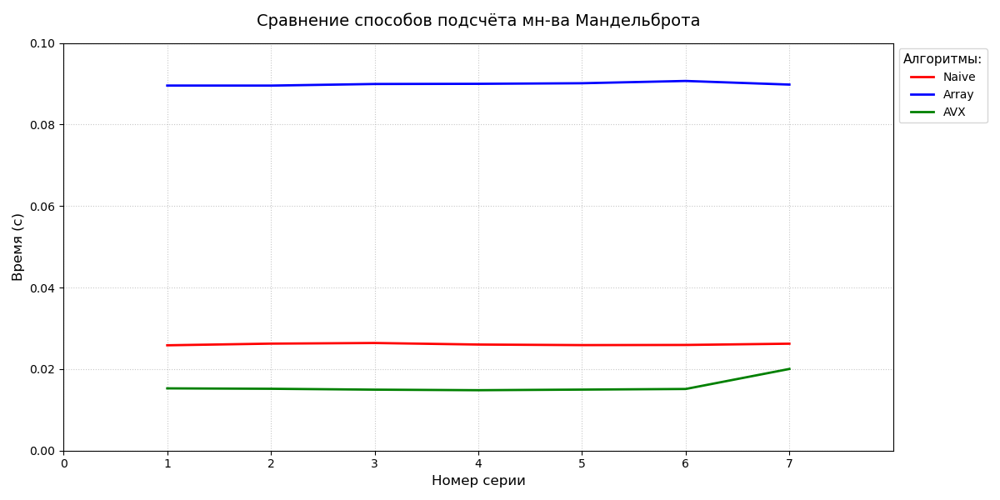

# Множество Мандельброта

## Множество Мандельброта и разные методы его просчёта

Про множество Мандельброта и его просчёт можно прочитать на википедии [вот ссылка](https://ru.wikipedia.org/wiki/%D0%9C%D0%BD%D0%BE%D0%B6%D0%B5%D1%81%D1%82%D0%B2%D0%BE_%D0%9C%D0%B0%D0%BD%D0%B4%D0%B5%D0%BB%D1%8C%D0%B1%D1%80%D0%BE%D1%82%D0%B0)

## При запуске программы:

### Таблица действий

|   Кнопка      |   Действие                |
|---------------|---------------------------|
|   :arrow_up   |   Сдвиг вверх изображения |
|   :arrow_down |   Сдвиг вниз изображения  |
|   :arrow_left |   Сдвиг влево изображения |
|   :arrow_rigth|   Сдвиг вправо изображения|
|   C           |   Изменение оптимизации   |
|   O           |   Приближение изображения |
|   P           |   Отдаление изображения   |
|   A           |   Увеличение шага сдвига  |
|   Z           |   Уменьшение шага сдвига  |
|   Esc         |   Закрытие окна           |

### Внешний вид окна с графическим представлением мно-ва Мандельброта

При малой оптимизации (наивный метод)

При большой оптимизации (AVX-инструкции)

Для графики (создание окна, прорисовки точек) использовалась библиотека SFML, подбробнее ознакомиться с ней можно на [этом сайте](https://www.sfml-dev.org/tutorials/2.6/start-linux.php)

## Методы оптимизации:
### Наивный:
    Просчёт каждой точки отдельно
### Массив:
    Просчёт массивами по 4 точки
### AVX:
    Просчёт точек по четвёркам при помощи AVX-инструкций (библиотека immintrin.h)

AVX-инструкции можно найти на [этом сайте](https://www.laruence.com/sse/#expand=3677&techs=MMX,SSE,SSE2,SSE3,SSSE3,SSE4_1,SSE4_2,AVX,AVX2)

## Способ измерения

Для измерения времени использовалась библиотека chrono, ознакомиться с ней можно на [Хабр](https://habr.com/ru/articles/324984/)

Внутри одного измерения я измерял время 1000 кадров и усреднял для уменьшения фактора погрешности. Каждое измерение делалось 7 раз
Результаты записаны в .csv файлы: Naive.csv, Array.csv, AVX.csv

По измерениям были построены графики на одном полотне при помощи python:

## Вывод

Все измерения были сделаны при помощи оптимизации -O2. Выбор обусловлен тем, что при большей оптимизации (-O3) цикл из 7 и 1000 раз сокращается до 1, что не позволяет что-либо измерять из-за возможной погрешности

Самой быстрой оказалась версия с AVX-инструкциями, что абсолютно логично, тк испоьзует параллелизм на уровне процессора + локализация внутри одного регистра

Наивный метод: нет параллелизма, зато отличная локальность данных, что позволяет не тратить время на обращения к массиву через индексы

Массив: параллелизм является "искуственным", тк точки всё равно обрабатываются последовательно, потому плохая локализация (а значит возможное обращение к памяти) и доп расходы на индексация ведут к тому, что такой метод просчёта является самым медленным

## P.S.

В папке TXLibVers можно найти версию для TXLib, которую можно запустить на windows, но скорость прорисовки настолько мала, что составляет порядка $10^{-2}$, потому было решено перейти на SFML. Такую колоссальную разницу в производительности объяснить легко: использование графического процессора, а не только CPU